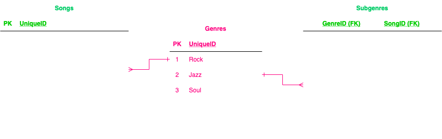

# SPOTIFY CHALLENGE
##### [for background on this challenge, please click this link to visit github](https://github.com/Justice-Through-Code/fall_2021/blob/main/challenges/databases/spotify_challenge.md)
##### friendly note: BEETLES and BEETLES in the table is likely a typo

 
 

In the `Songs` table we've added another column called `Genre`.

### SONGS
| ID  | Song               | ArtistId | AlbumId | Genre   |
| --- | ------------------ | -------- | ------- | ------- |
| 1   | Here Comes the Sun | 1        | 1       | Rock    |
| 2   | Come Together      | 1        | 1       | Rock    |
| 3   | Let It Be          | 1        | 2       | Rock    |
| 4   | Yesterday          | 1        | 3       | Rock    |
| 5   | Hey Jude           | 1        | 4       | Rock    |
| 6   | Hey JTC            | 2        | 5       | Hip Hop |

We're repeating *Rock* a number of times. This may not seem like a problem but consider the following:

-   If we had to rename `Rock` and our `Songs` table contained a **million** `Rock` songs, the time to complete such a change would be very long!
-   If we also wanted to assign a genre to an album in the `Albums` table in a similar way, we would have repeated data in multiple tables

 

## QUESTION 1
**a)** Briefly describe a better way of modeling genre data in the database to avoid some of the issues listed above. You can assume for the sake of simplicity there can be only one genre per song.

### **Q1a ANSWER**
*Create a new table for genre. Ensure each genre has a unique ID. Reference each genre by assigned IDs in other tables - which means each genre primary key will be a foreign key in other tables.*

 

## QUESTION 1
**b)** What relationship best describes how genre relates to songs in your answer to Question 1a?

### **Q1b ANSWER**
*Genre, now, relates to songs per primary keys in the genre table being referenced aka inputted into the songs table. Per the instructions, this is a one-to-one relationship. Ideally, as too is a one-to-one relationship, it is a one-to-many relationship. Realistically, it may be a many-to-many relationship.*

 

## QUESTION 2
What changes would you make to the modeling of genre data if we could assign more than one genre to a song?

### **Q2 ANSWER**
*Given this scenario likely creates a many-to-many relationship, I would need to prudently name/label each genre. For example, no Rock and Rock. Intead, Rock-Classic and Rock-Soul. I would basically need to create sub-genres. Compile the sub-genres into their own table. Use that table of sub-genres as an intermediary aka bridge table. This bridge table would be the connector between the Genres and Songs tables.*

 

    

