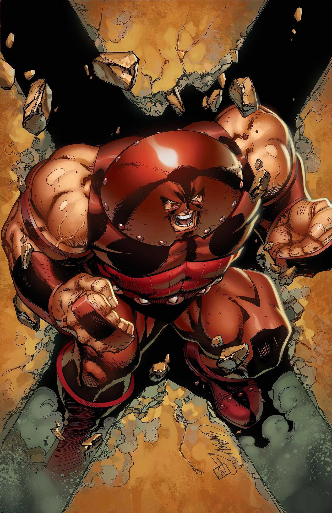
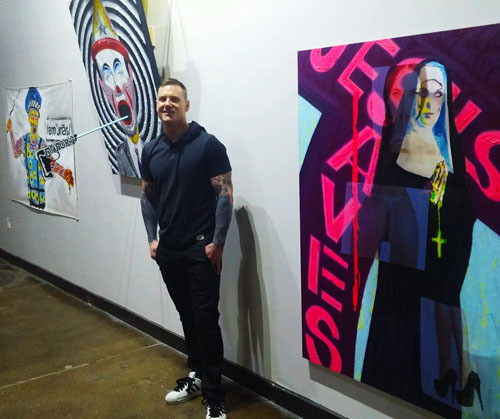
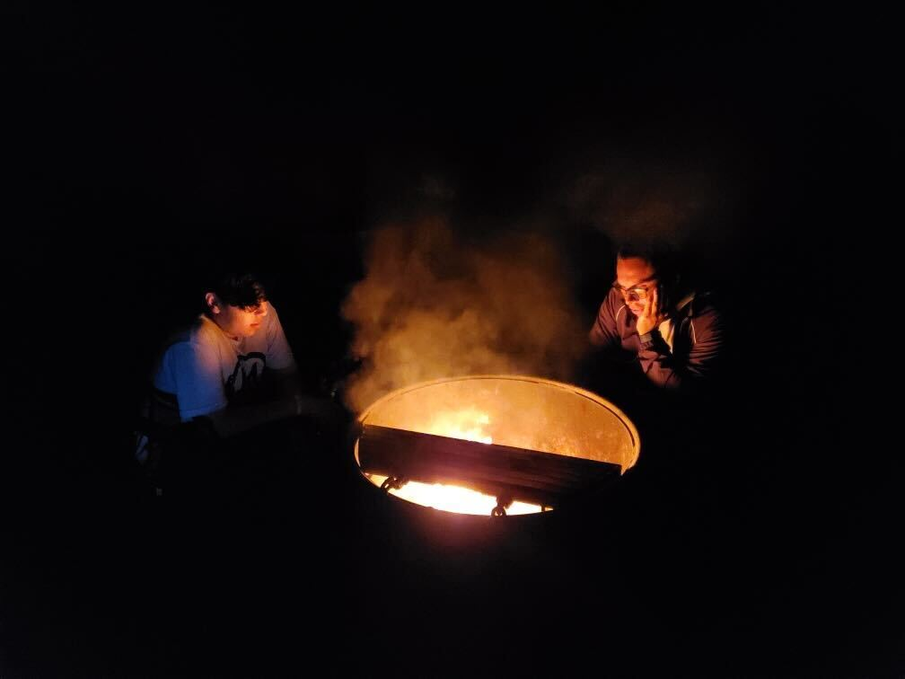
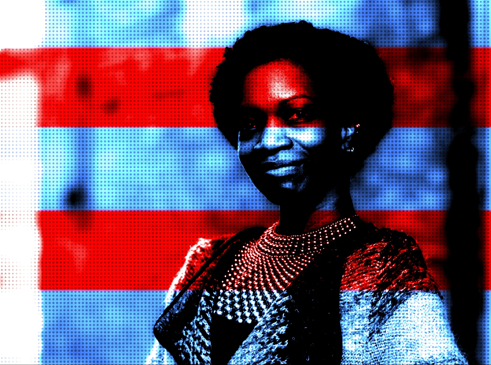

# 
Justice Through Code Fall 2021 Cohort

# **POD 1 REPO**
#### **POD MEMBERS:**
##### Tyler Toro, Anthony Caccamo, Brandon Grant, James Currie, Jason Doze, Jessy Martinez, La'Tonia Mertica Sheppard Walker

 

### **TYLER TORO** 
- Pod 1 Leader 
- Data Fellow, BallotReady 
- Teaching Assistant, Justice Through Code @ Columbia University 
- <a href="https://www.linkedin.com/in/tylertoro/">Tyler LinkedIn 
- [Email tyler.toro1@gmail.com ](mailto://tyler.toro1@gmail.com?Subject=Subject%20Text&Body=EmailTylerToro) 

*
In awe of possibilities viewing a sunset in Naples, Florida
*
 

 

### **ANTHONY CACCAMO** 
- Accountant 
- <a href="https://www.linkedin.com/in/anthony-caccamo/">Anthony LinkedIn</a> 
- [Email acaccamo100@gmail.com](mailto://acaccamo100@gmail.com?Subject=Subject%20Text&Body=EmailAnthonyCaccamo) 

*
Hello my name is Anthony. I am newly passionate to coding. As I learn more and more, I am starting to feel like Neo in the Matrix.
*
 

 

### **BRANDON GRANT** 
- Production Assistant 
<!-- 
 -->

---> Code by Brandon

*Code I'm proud of, took me a while to figure out how to make  multiplication look like a table. When I actually did, it felt good.* 

def multiplication_table(start, stop):

&emsp;&emsp;for x in range(start, stop+1): 
&emsp;&emsp;for y in range(start, stop+1): 
&emsp;&emsp;print(str(x*y), end= '') 

&emsp;&emsp;print()

- <a href="https://www.linkedin.com/in/brandon-grant021721/">Brandon LinkedIn</a> 
- [Email grant.b2134@gmail.com](mailto://grant.b2134@gmail.com?Subject=Subject%20Text&Body=EmailBrandonGrant) 

*
What's the good word?
*
 

 

### **JAMES CURRIE** 
- Full Stack Python Coder 
- Freelance Workforce 

---> Code by James

*This is code that takes code from another file to get things done. From parent class, to child class, to instantiation.* 

from stations_challenge import *

&emsp;&emsp;bus_stop2 = BusStation(station_name = 'NYC Megabus Stop', &emsp;&emsp;location = '34th street and 12th avenue' , &emsp;&emsp;routes = ['Boston', 'DC', 'Philly']) 

&emsp;&emsp;bus_stop2.show_info() 
&emsp;&emsp;print()

- <a href="https://www.linkedin.com/in/james-currie-88b494199/">James Linkedin</a> 
- [Email curriejames@icloud.com](mailto://curriejames@icloud.com?Subject=Subject%20Text&Body=EmailJamesCurrie) 

*
I have to put that extra on it, make it interesting for them.
*
 

 

### **JASON DOZE** 
- Photo/Videographer 
- Commercial Cannabis Consultant 
- <a href="https://www.linkedin.com/in/jason-doze/">Jason LinkedIn</a> 
- [Email jdoze@protonmail.com](mailto://jdoze@protonmail.com?Subject=Subject%20Text&Body=EmailJasonDoze) 

*
Hobby Artist: sculptor, painter, drawer, and digital artist
* 
 

 

### **JESSY MARTINEZ** 
- Case Manager Board Liaison Student 
- <a href="https://www.linkedin.com/in/jessy-martinez-72b70a195/">Jessy LinkedIn</a> 
- [Email martinezjessy393@gmail.com](mailto://martinezjessy393@gmail.com?Subject=Subject%20Text&Body=EmailJessyMartinez) 

*
What up! Holler at me. Tell me what you are doing, and  ow can I contribute to that positive energy of yours.....
*
 

 

### **LA'TONIA MERTICA SHEPPARD WALKER** 
##### pronounced *luh tone yuh merr treece*
- Communications Manager, Syracuse Surge 
- La'Tonia Mertica 'Comms & Creas Spec' 

<!-- 
 -->

---> Code by La'Tonia Mertica

*Code I've fashioned into creative expression, forcing positive energy into the universe in every which way within my humble power.* 

class CodeFuture: 

&emsp;def __init__(self, name, initiate, evo): 
&emsp;&emsp;self.name = str(name) 
&emsp;&emsp;self.initiate = int(initiate) 
&emsp;&emsp;self.evo = str(evo) 
 

pursue_code = CodeFuture():

print(f'{pursue_code.name} pursuing {pursue_code.evo} since {pursue_code.initiate}.') 
print()

- <a href="https://www.linkedin.com/in/latoniamertica/">La'Tonia Mertica LinkedIn</a> 
- [Email latoniamertica@gmail.com](mailto://latoniamertica@gmail.com?Subject=Subject%20Text&Body=EmailLa'ToniaMertica) 
    

*
Fanatic for exceptional communication - from hard work involved in communicating exceptionally to pure creative expression to basking in gratitude when communication is done masterfully. ..
*
